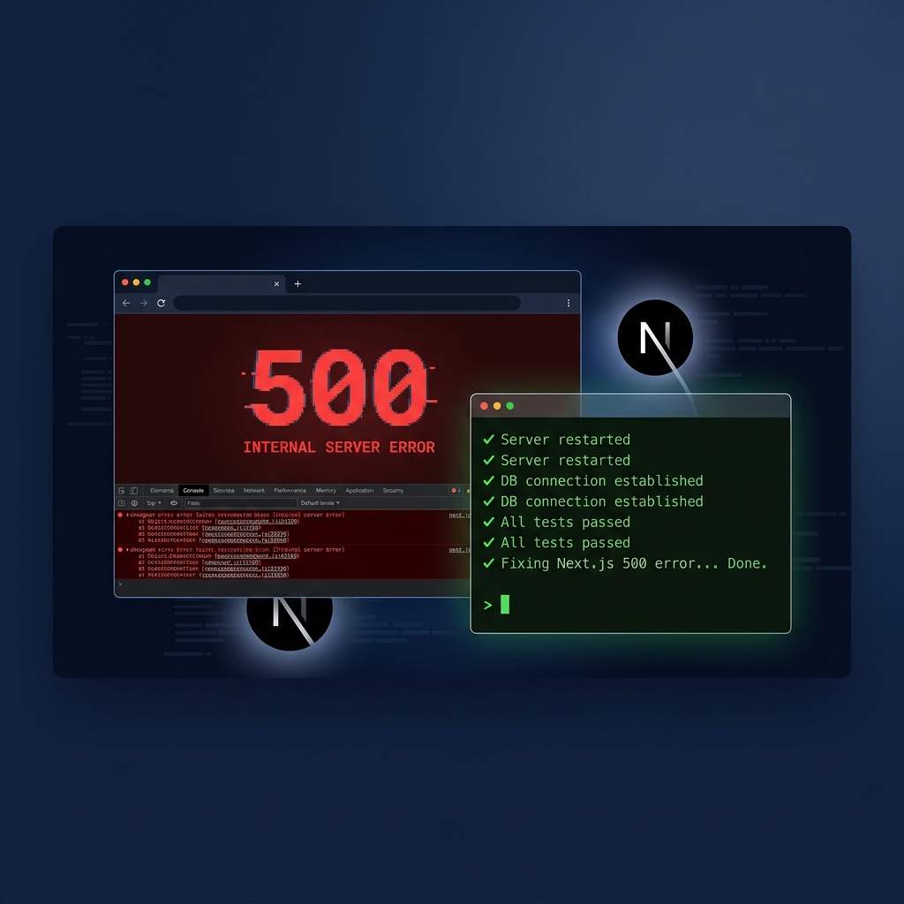

# 记一次 Next.js Dev 模式下全量静态资源 500 的排查与修复



> **TL;DR**：`next.config.js` 中的 `outputFileTracing: false` 和 `webpack({ cache: false })` 两个配置项，在 Next.js 14 的开发模式下会导致 webpack 无法正确将编译后的客户端 chunk 写入磁盘，使浏览器请求静态资源时全部返回 500 / 404，且每次修改代码后必现。删除这两个配置即可根治。

---

## 一、问题现象

在本地开发 Next.js 14 项目（App Router）时，刷新页面后浏览器控制台出现**大量 500 错误**，所有静态资源无一幸免：

```
GET http://localhost:3000/_next/static/css/app/layout.css?v=1780396461438    500 (Internal Server Error)
GET http://localhost:3000/_next/static/chunks/webpack.js?v=1780396461438     500 (Internal Server Error)
GET http://localhost:3000/_next/static/chunks/app-pages-internals.js         500 (Internal Server Error)
GET http://localhost:3000/_next/static/chunks/main-app.js?v=1780396461438    500 (Internal Server Error)
GET http://localhost:3000/_next/static/chunks/app/page.js                    500 (Internal Server Error)
```

### 关键特征

| 特征 | 描述 |
|------|------|
| **触发条件** | 修改任意源代码后刷新浏览器 |
| **影响范围** | 所有 `/_next/static/` 下的 CSS 和 JS 文件 |
| **复现率** | 100%，每次改完代码刷新必现 |
| **临时缓解** | `rm -rf .next && npm run dev` 能暂时恢复，但改代码后再次复现 |

---

## 二、排查过程

### 第一步：抓取服务端错误详情

直接 `curl` 请求 500 的资源，拿到服务端完整报错：

```bash
curl -s http://localhost:3000/_next/static/css/app/layout.css
```

在返回的 HTML 中的 `__NEXT_DATA__` 里提取到了关键错误信息：

```json
{
  "err": {
    "name": "Error",
    "message": "Cannot find module './948.js'\nRequire stack:\n- .next/server/webpack-runtime.js\n- .next/server/app/page.js\n..."
  }
}
```

> **关键线索**：webpack runtime 试图加载 `./948.js` 这个 chunk 文件，但该文件不存在于 `.next/server/` 目录中。

### 第二步：检查编译产物完整性

列出 `.next/static/` 目录中的实际文件：

```bash
$ find .next/static -type f | sort

.next/static/chunks/polyfills.js
.next/static/development/_buildManifest.js
.next/static/development/_ssgManifest.js
```

**对比预期**，以下关键文件全部缺失：

```diff
  .next/static/chunks/polyfills.js           ✅ 存在
- .next/static/chunks/webpack.js              ❌ 缺失
- .next/static/chunks/main-app.js             ❌ 缺失
- .next/static/chunks/app-pages-internals.js  ❌ 缺失
- .next/static/chunks/app/page.js             ❌ 缺失
- .next/static/chunks/app/layout.js           ❌ 缺失
- .next/static/css/app/layout.css             ❌ 缺失
```

尽管终端显示 `✓ Compiled / in 6.3s (1543 modules)` 表示编译成功，但 webpack **没有将这些 chunk 写入磁盘**。

### 第三步：审查 `next.config.js`

当时的配置文件如下：

```js
// ❌ 问题配置（修复前）
/** @type {import('next').NextConfig} */
const nextConfig = {
  outputFileTracing: false,                    // 🔴 问题 1
  experimental: {
    serverComponentsExternalPackages: ['puppeteer'],
  },
  webpack: (config, { dev }) => {
    if (dev) {
      config.cache = false;                    // 🔴 问题 2
    }
    return config;
  },
};

module.exports = nextConfig;
```

发现了两个可疑配置，逐一分析。

---

## 三、根因分析

### 🔴 问题 1：`outputFileTracing: false`

Next.js 从 v12 开始引入 `outputFileTracing`，用于自动跟踪每个页面所依赖的文件。在 Next.js 14 中：

- 该选项已被标记为**即将弃用**（启动时会打印警告）
- 设为 `false` 会干扰服务端编译的依赖追踪链路
- 导致服务端 webpack chunk 编号与实际文件不匹配

```
⚠ Disabling outputFileTracing will not be an option in the next major version.
```

### 🔴 问题 2：`webpack config.cache = false`（核心元凶）

这是导致问题反复出现的**核心原因**。

在 Next.js dev 模式下，webpack 使用**文件系统缓存**来管理编译产物的持久化。当设置 `cache: false` 时：

```
webpack 编译流程（正常情况）:
  源代码 → webpack 编译 → 内存中的 module → 持久化到 .next/static/ → 浏览器加载 ✅

webpack 编译流程（cache: false）:
  源代码 → webpack 编译 → 内存中的 module → ❌ 不写入磁盘 → 浏览器 404/500
```

具体影响链路如下：

```
┌────────────────────────────────────────────────────────────────┐
│  config.cache = false                                          │
│  ↓                                                             │
│  webpack 禁用文件系统缓存                                        │
│  ↓                                                             │
│  编译产物仅存在于内存中，不持久化到 .next/static/                    │
│  ↓                                                             │
│  浏览器请求 /_next/static/chunks/app/page.js                     │
│  ↓                                                             │
│  Next.js dev server 在磁盘上找不到该文件                           │
│  ↓                                                             │
│  返回 404 或触发 fallback 错误 → 500                              │
└────────────────────────────────────────────────────────────────┘
```

### 为什么 `rm -rf .next` 能临时恢复？

删除 `.next` 后重启 dev server，Next.js 会执行完整的冷启动编译。冷启动时即使 `cache: false`，首次编译的 chunk 仍会被写入磁盘（因为此时是 initial compilation incremental rebuild）。但当你修改代码触发热更新时，增量编译的产物就不会写入磁盘了——于是 500 再次出现。

---

## 🔍 补充增补：并发构建冲突与端口抢占引发的 404/500（2026-06-03 追更）

在移除了 `cache: false` 全局禁用后，开发中我们又遇到了“即使清空了 `.next` 并重启 dev，依然 100% 出现静态资源 404，且热更新失效”的顽疾。经过深度排查，发现了两个隐藏的深水配置机制：

### 🔴 问题 3：并发执行 `npm run build` 和 `npm run dev` 导致缓存写锁损坏
在本地 `npm run dev` 运行且挂载文件监听时，如果开发者（或 AI 助手自动校验）在终端频繁并发执行 `npm run build`，生产构建进程会在同一时间对同一个缓存文件夹（`.next/cache/webpack/`）执行强行覆写和清空。
这会直接导致 Webpack 持久化缓存损坏，报以下错误：
`[Error: ENOENT: no such file or directory, stat '.next/cache/webpack/client-development/4.pack.gz']`
一旦缓存包文件（如 `4.pack.gz`）损坏或丢失，后台开发服务的增量重编译（Incremental rebuild）将无法正常把生成的 client chunk 写入磁盘，导致 HMR 瘫痪、页面 404，必须被迫重启。

### 🔴 问题 4：3000 端口老进程强占（冷启动依然 404 的罪魁祸首）
当本地开发服务异常终止后，有可能在后台遗留了未被杀死的 Next.js 僵尸进程依然强占着 `3000` 端口。
此时，重新运行 `npm run dev` 会由于端口冲突而自动偏移（或者报错），但浏览器仍然在持续请求 `3000` 端口上的老进程。由于老进程的 `.next` 缓存目录在本次冷启动中已被清空重构，老进程在磁盘上无法定位到新的静态哈希文件，因此无论浏览器如何重载刷新（即使勾选了 **Disable cache** 停用缓存），都会持续返回 404 资源缺失错误。

---

## 四、修复方案

移除这两个有问题的配置：

```diff
  /** @type {import('next').NextConfig} */
  const nextConfig = {
-   outputFileTracing: false,
    experimental: {
      serverComponentsExternalPackages: ['puppeteer'],
    },
-   webpack: (config, { dev }) => {
-     if (dev) {
-       config.cache = false;
-     }
-     return config;
-   },
  };

  module.exports = nextConfig;
```

修复后的完整配置：

```js
// ✅ 2026-06-03 终极修复方案：多进程缓存隔离与自动防强占配置
/** @type {import('next').NextConfig} */
const nextConfig = {
  experimental: {
    serverComponentsExternalPackages: ['puppeteer'],
  },
  webpack: (config, { dev }) => {
    if (!dev) {
      // 生产环境构建时禁用 Webpack 持久化缓存。
      // 这能彻底防止打包进程与后台常驻的 dev 开发进程发生写锁竞争，保证本地 HMR 热更新正常！
      config.cache = false;
    }
    return config;
  },
};

module.exports = nextConfig;

### 终极修复机制：
通过检测 `!dev`（即非开发模式，例如生产打包），将 Webpack 的 `config.cache` 设为 `false`。由于 `next dev` 依然保持默认开启缓存（写入默认的 `.next/cache`），这能带来两点巨大优势：
1. **彻底缓存隔离**：`build` 打包时不会再读写与污染 `.next/cache/webpack` 目录，彻底杜绝了并发读写造成的 `4.pack.gz` 文件丢失和 HMR 瘫痪。
2. **极速热更新**：开发状态下的缓存读写不受影响，热重载效率依旧维持在毫秒级别。
```

### 修复后验证

清理缓存并重启：

```bash
rm -rf .next && npm run dev
```

访问页面触发编译后，检查所有静态资源：

```bash
$ find .next/static -type f | sort

.next/static/chunks/app-pages-internals.js    ✅
.next/static/chunks/app/layout.js             ✅
.next/static/chunks/app/page.js               ✅
.next/static/chunks/main-app.js               ✅
.next/static/chunks/polyfills.js              ✅
.next/static/chunks/webpack.js                ✅
.next/static/css/app/layout.css               ✅
.next/static/development/_buildManifest.js    ✅
.next/static/development/_ssgManifest.js      ✅
```

HTTP 状态码全部正常：

```
page.js:               200 ✅
layout.css:            200 ✅
main-app.js:           200 ✅
app-pages-internals.js: 200 ✅
webpack.js:            200 ✅
```

修改代码后刷新，热更新正常工作，不再出现 500 错误。

---

## 五、经验总结

### 📌 要点速查表

| 问题源/配置项 | 风险等级 | 影响与排查 |
|--------|---------|------|
| `outputFileTracing: false` | ⚠️ 中 | 干扰服务端编译追踪，Next.js 14+ 已弃用 |
| `webpack.cache = false` (全量) | 🔴 高 | dev 模式下增量编译不写入磁盘，改代码即导致静态资源 500/404 |
| 并发运行 `dev` 和 `build` | 🔴 高 | 两个进程争抢 `.next/cache` Webpack 缓存，造成缓存包损坏（HMR 彻底瘫痪） |
| `3000` 端口老进程残留 | 💀 致命 | 浏览器请求落入已丢失缓存的僵尸服务，即使 Disable cache 刷新也持续 404 |

### 🛡️ 防护建议

1. **落实现生产构建缓存禁用（隔离）**：在 `next.config.js` 的 `webpack` 钩子中，设置仅在 `!dev` 时禁用缓存，从根本上隔离生产编译和开发持久缓存竞争。

2. **开发规范守则**：严禁在 `npm run dev` 常驻的开发状态下，频繁且多余地在终端运行 `npm run build`。校验应交由开发服务自身的增量重载和类型检查完成。

3. **清理僵尸进程**：当遇到“不管怎么清理缓存重载页面，都始终 404 静态资源”时，应立即使用下述命令强杀 3000 端口上的陈旧占用进程：
   `npx kill-port 3000` 或 `lsof -i :3000 -t | xargs kill -9`
   强杀后，重新 `rm -rf .next && npm run dev` 即可彻底满血复活。

---

## 环境信息

| 项目 | 版本 |
|------|------|
| Next.js | 14.2.29 |
| Node.js | 18.18.2 |
| 操作系统 | macOS |
| 包管理器 | npm |

---

*记录日期：2026-06-02*
