# 简历双向同步与刷新状态保持设计规格说明

本项目在本地开发环境下，需要支持 Web 端简历编辑与本地 `src/data/defaultResume.json` 磁盘文件的双向实时同步，并且在浏览器刷新或 WebSocket 重连时能够保持正确的最新的状态。

## 架构与设计原理

本设计采用 **基于客户端时间戳与服务端文件修改时间的双向时间戳同步（Last-Write-Wins）冲突解决策略**，以保证在复杂的多端编辑、刷新、同步服务断线等场景下，数据始终向最新的一方收敛，且不产生死循环。

```mermaid
sequenceDiagram
    participant WebPage as Web 页面 (Client)
    participant LocalDraft as Zustand (LocalStorage)
    participant SyncServer as 同步服务器 (ws://localhost:3001)
    participant Disk as defaultResume.json (磁盘)

    Note over WebPage, LocalDraft: 1. Web端用户修改简历
    WebPage->>LocalDraft: 修改数据 (如 updateBasicInfo)
    Note over LocalDraft: 自动注入 updatedAt = Date.now()
    LocalDraft->>SyncServer: 800ms防抖 client_changed (携带数据与 updatedAt)
    SyncServer->>Disk: writeFileSync 覆写文件
    Note over Disk: 自动更新文件 mtimeMs

    Note over SyncServer, Disk: 2. 本地 AI 或外部修改文件
    Disk->>SyncServer: fs.watch 监听到磁盘变化
    SyncServer->>WebPage: server_changed (带有最新 mtimeMs 补全的 updatedAt)
    Note over WebPage: 比对: server.updatedAt > client.updatedAt
    WebPage->>LocalDraft: overwriteActiveResume 覆盖数据
    Note over LocalDraft: 保存数据且 _isSyncFromServer 阻止发回

    Note over WebPage, LocalDraft: 3. 浏览器刷新 / 重连
    WebPage->>LocalDraft: 从 LocalStorage 还原 (含 updatedAt)
    WebPage->>SyncServer: 建立 WebSocket 连接
    SyncServer->>WebPage: 连接成功，立即推送 server_changed (含 mtimeMs)
    alt 客户端 updatedAt > 服务端 updatedAt (客户端有未同步数据)
        WebPage->>SyncServer: 主动发送 client_changed 同步客户端数据
        SyncServer->>Disk: 写入文件
    else 服务端 updatedAt > 客户端 updatedAt (服务端有AI的更新)
        WebPage->>LocalDraft: 强制覆盖本地状态，更新界面
    else 数据内容一致
        Note over WebPage: 忽略，不作任何处理
    end
```



---

## 模块设计细节

### 1. 数据结构改动

在 [src/types/resume.ts](file:///Users/neoyuan/Desktop/aoyi/AI-resume-design/src/types/resume.ts) 的 `ResumeData` 接口中添加 `updatedAt` 时间戳：

```typescript
export interface ResumeData {
  id: string;
  resumeName?: string;
  theme: ResumeTheme;
  basicInfo: BasicInfo;
  // ... 其他属性保持不变
  updatedAt?: number; // 新增：最后修改时间戳
}
```

### 2. Zustand Store 修改

在 [src/store/useResumeStore.ts](file:///Users/neoyuan/Desktop/aoyi/AI-resume-design/src/store/useResumeStore.ts) 中：

*   **多简历同步中间件 `syncResumesMiddleware`**：
    拦截状态修改。如果 `resume` 发生更新，且本次更新没有携带 `_isSyncFromServer: true` 标记（表明是用户在 UI 上操作或非服务端同步引起的变化），则自动为更新后的 `resume` 注入 `updatedAt = Date.now()`。
    
*   **状态覆盖动作 `overwriteActiveResume`**：
    当接收到来自服务端的数据时，调用此方法更新 Zustand。
    需要保留服务端传过来的 `updatedAt`，并在返回的 nextState 里附加 `_isSyncFromServer: true` 标记，用于告诉中间件“这是一次服务端同步动作，不需要更新 `updatedAt` 为当前时间，也不需要重复推送回服务端”。

*   **本地数据恢复 `onRehydrateStorage`**：
    在从 `localStorage` 恢复时，如果简历没有 `updatedAt` 属性，默认为其补全为 `0`，以便于第一次与服务端做同步判定。

### 3. 同步连接器修改

在 [src/components/shared/SyncServerConnector.tsx](file:///Users/neoyuan/Desktop/aoyi/AI-resume-design/src/components/shared/SyncServerConnector.tsx) 中：

*   **消息接收处理 `ws.onmessage`**：
    *   首先通过 `JSON.stringify` 字符串比对和 `isSameResumeContent` 比对，排除内容没有发生实际改变的推送。
    *   内容不同时，提取 `clientUpdatedAt = currentResume.updatedAt || 0` 和 `serverUpdatedAt = receivedData.updatedAt || 0`：
        *   如果 `clientUpdatedAt > serverUpdatedAt`：说明客户端有本地更新，直接拒绝覆盖，并通过 WebSocket 向服务端反向发送 `client_changed` 消息更新服务端。
        *   如果 `serverUpdatedAt >= clientUpdatedAt`：说明服务端有外部修改，客户端执行 `overwriteActiveResume(receivedData)` 覆盖本地状态，并更新页面渲染。

### 4. 服务端修改

在 [scripts/sync-server.js](file:///Users/neoyuan/Desktop/aoyi/AI-resume-design/scripts/sync-server.js) 中：

*   **读取简历 `readResumeData`**：
    获取 `FILE_PATH`（`defaultResume.json`）的内容后，读取该文件的修改时间戳：
    `const stats = fs.statSync(FILE_PATH);`
    返回的数据中的 `updatedAt` 设为 `Math.max(parsed.updatedAt || 0, Math.floor(stats.mtimeMs))`。这能确保即使 AI 直接改写了文件（未能更新 JSON 中的 `updatedAt`），系统也能通过文件的物理修改时间戳感知最新更改。
*   **写入简历（客户端 client_changed）**：
    直接覆写 `defaultResume.json`。覆写后，文件修改时间 `mtimeMs` 自动更新为当前系统时间。
*   **文件监听 `fs.watch` 广播**：
    同样，在广播 `server_changed` 时，如果内容真的改变了，广播的数据中 `updatedAt` 属性需要使用最新的 `mtimeMs` 补全。

---

## 错误处理与容错

1.  **系统时间差异**：因为客户端和服务端均在用户本地（localhost/127.0.0.1）运行，因此两者的系统时间完美同步，不存在物理节点时间差的问题。
2.  **网络延迟或重连**：当客户端与服务端失去连接（如服务未启动）时，客户端对 `localStorage` 的修改不受影响，`updatedAt` 会在本地持续累加。一旦 WebSocket 重新连接，连接成功后服务端会立即触发一次 `server_changed` 推送，此时客户端的 `updatedAt` 明显大于服务端的文件修改时间，便会自动触发数据反向同步，把断联期间的所有修改一次性同步给本地文件。
